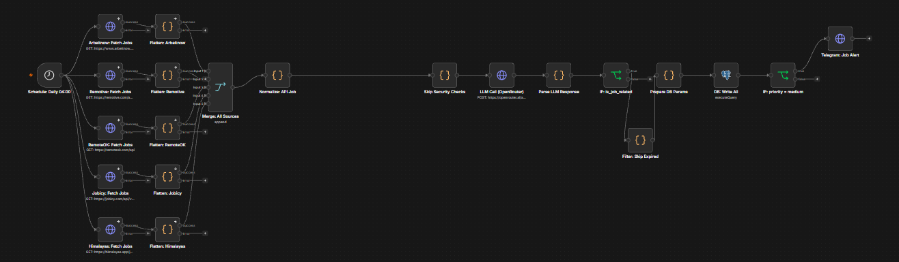
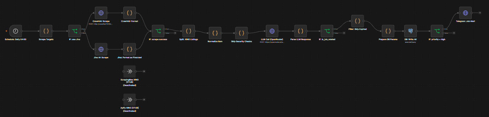
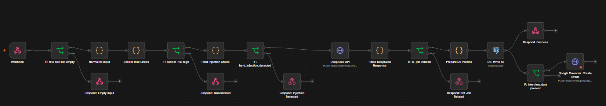

# JobRadar — AI-Powered Job Search Automation

> Personal job-search intelligence hub built on n8n, Postgres, and LLM-based parsing.
> Ingests jobs from 6 sources, classifies them via AI, stores structured data, and delivers daily digests to Telegram.

---

## Workflow Screenshots

### Story 1 — Multi-Source Job Aggregation (Flow 4: Job APIs)
5 parallel API sources → Normalize → AI scoring → Postgres + Telegram alert



---

### Story 2 — LLM Parser with Qwen3 `<think>` stripping (Flow 3: Manual Input)
Qwen3 returns CoT `<think>` blocks before JSON — one regex line strips them before `JSON.parse()`



---

### Story 3 — Silent Data Loss Fix: Dedup Check (Flow 2: Web Scraper)
`SELECT id LIMIT 1` returned 0 rows for new jobs → IF node never ran → silent drop. Fixed with `SELECT COUNT(*) AS cnt`.



---

## What this is

A fully automated job tracking system that replaces manual job board browsing.
Every source — Gmail inbox, IMAP, public APIs, web scraping, and manual input — feeds into one unified pipeline.
An LLM acts as a structured parser: it classifies emails, extracts job metadata, assigns relevance scores, and detects security threats before anything reaches the database.

---

## Architecture

```
┌─────────────────────────────────────────────────────────────┐
│                        Sources (6)                          │
│  Gmail  ·  mail.de IMAP  ·  Arbeitnow API  ·  Remotive API │
│         RemoteOK API  ·  Firecrawl (web scraping)          │
└───────────────────────────┬─────────────────────────────────┘
                            │
              ┌─────────────▼─────────────┐
              │     Normalize to schema    │
              │   (unified input format)   │
              └─────────────┬─────────────┘
                            │
        ┌───────────────────▼──────────────────────┐
        │           Security Layer                  │
        │  Sender risk classification (email only)  │
        │  · Typosquatting detection                │
        │  · Disposable domain check                │
        │  · Scam keyword patterns                  │
        │  Hard injection check                     │
        │  · 16 regex patterns for prompt injection  │
        └───────────────────┬──────────────────────┘
                            │
              ┌─────────────▼─────────────┐
              │    LLM Parser (Qwen3)      │
              │  via OpenRouter            │
              │  · Structured JSON output  │
              │  · relevance_score 1–100   │
              │  · Category, stage, salary │
              │  · Injection re-check      │
              └─────────────┬─────────────┘
                            │
        ┌───────────────────▼──────────────────────┐
        │              Postgres                     │
        │  companies → employers → jobs             │
        │               → job_events               │
        │  Idempotent upserts (ON CONFLICT)         │
        │  Multi-tenant schema (tenant_id)          │
        └───────────┬───────────────┬──────────────┘
                    │               │
         ┌──────────▼──┐    ┌───────▼──────────┐
         │  Realtime    │    │  Daily Digest     │
         │  Telegram    │    │  07:00 — TOP-5    │
         │  alert       │    │  relevance ≥ 80   │
         │  (priority=  │    │  → Telegram       │
         │   high)      │    └──────────────────┘
         └─────────────┘
```

---

## Flows

| Flow | Trigger | Sources |
|------|---------|---------|
| Gmail | Realtime (polling) | Gmail inbox |
| mail.de IMAP | Every 15 min | IMAP inbox |
| Job APIs | Daily 04:00 | Arbeitnow · Remotive · RemoteOK · Jobicy · Himalayas |
| Web Scraper | Daily 04:00 | 5 job boards via Crawl4AI (self-hosted) + Jina AI |
| Corporate Pages | Daily 06:00 | 8 companies via Greenhouse / Ashby ATS APIs |
| Gewerbe / Freelance | Daily 04:30 | 5 freelance platforms via Jina AI |
| RSS Job Feed | Every 6h | 7 RSS feeds |
| Manual Input | Webhook / on demand | Any raw text |
| Sheets Export | Manual trigger | Postgres → Google Sheets |
| Embedding Updater | Manual trigger | Postgres → pgvector embeddings |
| Telegram /digest | On command `/digest` | Postgres → Telegram reply |
| Daily Digest | Daily 07:00 | Postgres → Telegram |

---

## Security design

The pipeline handles untrusted external content — job board emails can carry prompt injection attacks targeting the LLM parser. Two defence layers run before every LLM call:

**1. Sender risk classification (email flows)**
- Known-good domain allowlist (60+ job portals and ATS platforms)
- Typosquatting detection via Levenshtein distance against known portals
- Disposable and free email provider detection
- Scam keyword patterns in subject and body
- Output: `sender_risk_level` (low / medium / high) + `sender_risk_signals[]`

**2. Hard injection check**
- 16 regex patterns covering common injection techniques:
  `"Ignore previous instructions"`, `"[INST]"`, `"SYSTEM:"`, `"<|im_start|>"`, base64 payloads, etc.
- Runs on subject + body before the LLM sees the text
- High-risk or injection-detected items are quarantined, not processed

**3. LLM-level re-check**
- System prompt explicitly instructs the model to set `injection_suspected: true` if it detects attempts in input fields
- Validated against JSON Schema before DB write

**Additional:**
- No secrets in code — all via `$env.VARIABLE_NAME` in n8n nodes
- Parameterized queries only — no string interpolation into SQL
- PII-aware logging — email bodies never logged to external systems
- Input size limits (10,000 chars) before LLM call

---

## Data model

```sql
companies    (company_id slug, name, meta jsonb, tenant_id)
employers    (employer_id, company_id FK, name, tenant_id)
jobs         (job_id_fuzzy, company_id, title, location, seniority,
              work_mode, salary_*, tech_stack[], current_stage,
              priority, relevance_score, source_url, tenant_id)
job_events   (job_id FK, input_source, category, action, stage,
              raw_text, parsed_json, sender_risk_level,
              sender_risk_signals[], created_at)
```

Key decisions:
- `job_id_fuzzy = {company_id}__{normalized-title}__{location}` — human-readable dedup key
- All writes are idempotent (`ON CONFLICT DO UPDATE`) — safe to retry or re-run
- `tenant_id` on every table — multi-tenant-ready without a schema rewrite
- `job_events` is append-only — full audit trail of every state change

---

## LLM integration

The system prompt (`spec/prompt-system.txt`) is a 22k-character extraction engine that:
- Returns a flat JSON object with 40+ typed fields
- Validates `company_id` slug format, enum values, date resolution
- Resolves relative dates ("next Friday", "in two weeks") against the anchor date
- Handles German and English job content
- Distinguishes `interview_invite` / `test_task` / `offer` / `rejection` / `platform_notification`
- Never infers values not explicitly stated — prefers `null` over guessing

Output is validated against a formal JSON Schema (draft-07) before DB write.

---

## Tech stack

| Layer | Tools |
|-------|-------|
| Orchestration | n8n (self-hosted, Docker) |
| LLM | Qwen3-30B via OpenRouter |
| Database | PostgreSQL 16 + pgvector |
| Web scraping | Crawl4AI (self-hosted) + Jina AI Reader |
| Notifications | Telegram Bot API |
| Calendar | Google Calendar API |
| Spreadsheets | Google Sheets (via Apps Script) |
| Infrastructure | VPS (Hetzner), Docker Compose |

---

## Repo structure

```
spec/
  prompt-system.txt           # LLM system prompt (22k chars)
  prompt-context.md           # Briefing: JSON contract + principles
  job-json-schema.json        # JSON Schema (draft-07) for output validation
  known-domains.json          # Allowlist for sender risk classification

db/
  schema.sql                  # Postgres DDL with enums, indexes, RLS stubs
  migrations/                 # Incremental migrations (001–003 applied)

n8n/
  gmail-flow-api.json         # Flow 1:  Gmail
  mailde-flow-api.json        # Flow 1b: mail.de IMAP
  firecrawl-flow-api.json     # Flow 2:  Web Scraper (Crawl4AI + Jina)
  corporate-flow-import.json  # Flow 2b: Corporate Career Pages (Greenhouse/Ashby)
  manual-flow-api.json        # Flow 3:  Manual input webhook
  job-apis-flow-api.json      # Flow 4:  Job APIs (5 sources)
  daily-digest-flow-api.json  # Flow 5:  Daily Digest → Telegram
  sheets-export-flow-api.json # Flow 6:  Sheets Export → Google Sheets
  gewerbe-flow-api.json       # Flow 7:  Gewerbe / Freelance Scraper
  telegram-digest-flow-api.json # Flow 8: Telegram /digest command
  embedding-updater-flow.json # Flow 9:  pgvector Embedding Updater
  rss-flow-api.json           # Flow 10: RSS Job Feed
  flows.md                    # Logical workflow designs

gas/
  sheets-writer-v2.gs         # Google Apps Script: Sheets writer + Anschreiben button

docs/
  deploy.md                   # Step-by-step deployment guide
  job-radar-architecture.md   # Architecture overview
  security.md                 # Security checklist
  backup.md                   # Backup system reference

scripts/
  backup.sh                   # DB backup script (cron-ready, 3×/day)

.env.example                  # All required env vars with descriptions
```

---

## Deployment

See [`docs/deploy.md`](docs/deploy.md) for the full step-by-step guide.

**Requirements:**
- n8n v1.100+ (self-hosted)
- PostgreSQL 16
- OpenRouter API key (or any OpenAI-compatible endpoint)
- Telegram bot token + chat ID
- Google OAuth credentials (Gmail + Calendar)

**Environment variables:** see [`.env.example`](.env.example)

---

## Design philosophy

Built to **portfolio + small-business grade**:

- **Explicit over implicit** — all JSON fields always present, no silent defaults
- **Idempotent** — every operation is safe to retry
- **Secure by default** — two-layer injection defence, no PII in logs, parameterized SQL
- **Scalable** — multi-tenant schema, stateless LLM parser, connection-pool-ready
- **Documented** — every non-obvious decision has a comment explaining why

---

## Status

| Flow | Status |
|------|--------|
| Gmail | ✅ Active |
| mail.de IMAP | ✅ Active |
| Web Scraper (Crawl4AI + Jina) | ✅ Active |
| Corporate Career Pages | ✅ Active |
| Job APIs (5 sources) | ✅ Active |
| Gewerbe / Freelance Scraper | ✅ Active |
| RSS Job Feed | ✅ Active (every 6h) |
| Manual Input | ✅ Active · E2E tested |
| Daily Digest | ✅ Active · E2E tested |
| Telegram /digest | ✅ Active |
| Sheets Export | ✅ Deployed (manual trigger) |
| Embedding Updater | ✅ Deployed (manual trigger) |
| Backup system | ✅ 3×/day via cron |
